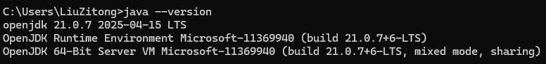

# Coursera-Algorithms
## 课程网站
* [Algorithms Part I](https://www.coursera.org/learn/algorithms-part1)
* [Algorithms Part II](https://www.coursera.org/learn/algorithms-part2)
## 课程教材
[Algorithms, 4th edition](https://algs4.cs.princeton.edu/home/)
## 环境配置
* 下载JDK，更新环境变量
  
* 下载IDEA
* 下载官方库alg4.jar和官方数据包alg4-data.zip
* 更新CLASSPATH环境变量(.;不能少！)
  
* IDEA配置
  
  