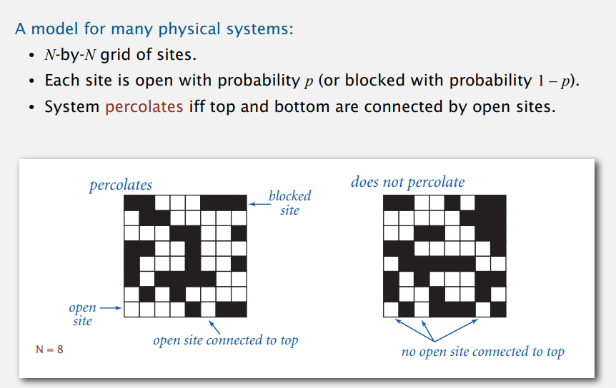
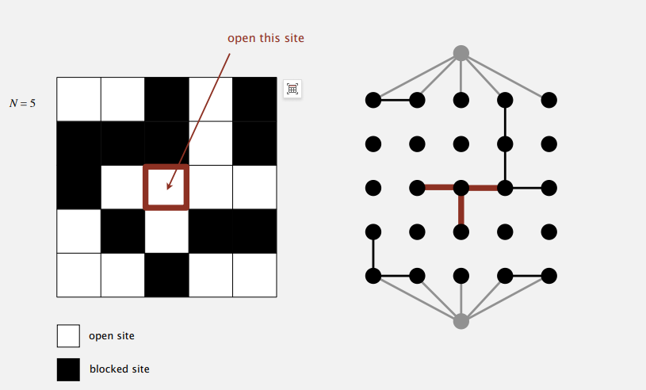

# Percolation(渗透)(94/100)

* 思路：使用双节点`virtualTop`和`virtualBottom`
  
* 倒灌问题
  * 判断是否渗透直接通过判断`virtualTop`、`virtualBottom` 是否`connected()`。所以一旦渗透，所有与`virtualBottom`节点相连的节点也就都与`virtualTop`相连了。
  * 解决方法：将原方案中表示open的boolean数组改为byte数组，设定规则如下
    * 初始化的默认值0代表blocked site
    * 每open一个，如果位于尾行则赋2，否则赋1
    * 分别对每个邻接site检测，如任何一方的root site对应byte值为2，将双方union后的root site设为2
